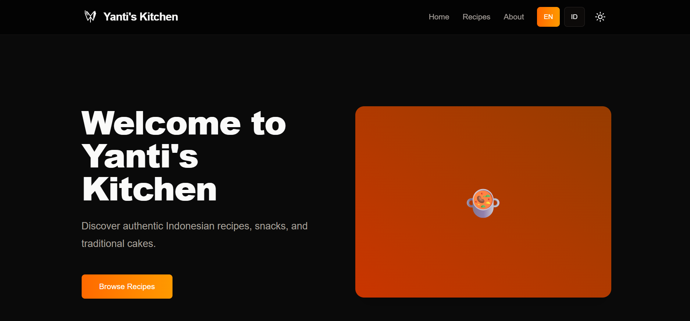

<div align="center">
  

  <h1>🍜 Yanti's Kitchen</h1>

  <p><em>Discover authentic Indonesian recipes, snacks, and traditional cakes.</em></p>

  <p>
    
    
    
    
    
  </p>

  <p>
    <a href="#-features">Features</a> •
    <a href="#-tech-stack">Tech Stack</a> •
    <a href="#-getting-started">Getting Started</a> •
    <a href="#-deployment">Deployment</a>
  </p>

  <br />

  

</div>

---

## 📖 Description

**Yanti's Kitchen** is a modern web application built to showcase delicious and authentic Indonesian recipes. It features a fully bilingual interface (🇬🇧 English & 🇮🇩 Indonesian) and a beautiful, responsive design optimized for both desktop and mobile.

A custom admin CMS is included, with JWT-secured authentication and OTP-based login, giving content editors a professional dashboard to manage recipes without touching the codebase.

---

## ✨ Features

| Feature | Description |
|---|---|
| 🌐 **Bilingual Support** | Seamlessly toggle between English and Indonesian via a custom i18n Context provider |
| 🌙 **Dark Mode** | Full light/dark theme support powered by `next-themes` |
| 🛠️ **Admin CMS** | A custom dashboard at `/admin` for creating, editing, and deleting recipes |
| 🔐 **Authentication** | JWT-secured admin area with OTP login delivered via email (mocked with Ethereal) |
| 📦 **Data Storage** | Lightweight JSON file storage (`data/recipes.json` & `data/users.json`) via Next.js API Routes |
| 📱 **Responsive Design** | Mobile-first layout with Tailwind CSS, including a hamburger navigation menu |
| 🎞️ **Animations** | Fluid transitions and micro-interactions powered by Framer Motion |

---

## 🛠 Tech Stack

### Frontend

- **[Next.js](https://nextjs.org/)** — App Router with React 19
- **[Tailwind CSS v4](https://tailwindcss.com/)** — Utility-first styling, mobile-first approach
- **Custom UI Components** — Shadcn/UI-style components built with standard Tailwind + `@radix-ui/react-slot`
- **[Framer Motion](https://www.framer.com/motion/)** — Animations and page transitions
- **[Lucide React](https://lucide.dev/)** — Icon library

### Internationalization

- Custom React Context provider for EN/ID language switching (no external i18n library required)

### Backend & Auth

- **Next.js Route Handlers** — REST-style API with local JSON file storage
- **`jsonwebtoken`** — JWT generation and verification
- **`bcryptjs`** — Password hashing
- **`nodemailer`** — OTP email delivery (Ethereal mock in development)
- **Next.js Middleware (Proxy)** — Secure cookie-based auth route protection

---

## 🚀 Getting Started

### Prerequisites

- Node.js `v18+`
- npm / yarn / pnpm / bun

### Installation

Clone the repository and install dependencies:

```bash
git clone https://github.com/your-username/yantis-kitchen.git
cd yantis-kitchen
npm install
```

### Environment Variables

Create a `.env.local` file in the root directory:

```env
JWT_SECRET=your_jwt_secret_here
EMAIL_HOST=smtp.ethereal.email
EMAIL_PORT=587
EMAIL_USER=your_ethereal_user
EMAIL_PASS=your_ethereal_password
```

> 💡 For development, use [Ethereal](https://ethereal.email/) to generate free SMTP credentials for OTP email testing.

### Running the Development Server

```bash
npm run dev
# or
yarn dev
# or
pnpm dev
# or
bun dev
```

Open [http://localhost:3000](http://localhost:3000) in your browser to see the app.

### Admin Dashboard

Access the Admin CMS at [http://localhost:3000/admin](http://localhost:3000/admin).

Register a new account (Editor role) or log in — an OTP will be sent to your email for verification.

---

## 📁 Project Structure

```
yantis-kitchen/
├── app/
│   ├── admin/          # Admin CMS dashboard & auth pages
│   ├── api/            # Next.js Route Handlers (recipes, users, auth)
│   └── page.tsx        # Main recipe showcase page
├── components/         # Reusable UI components
├── context/            # i18n language context provider
├── data/
│   ├── recipes.json    # Recipe data store
│   └── users.json      # User data store
├── public/             # Static assets (logo, images)
└── middleware.ts       # JWT auth proxy for route protection
```

---

## 🌐 Deployment

The recommended way to deploy this app is via **[Vercel](https://vercel.com/new?utm_medium=default-template&filter=next.js&utm_source=create-next-app&utm_campaign=create-next-app-readme)** — the platform built by the creators of Next.js.

```bash
# Install Vercel CLI
npm i -g vercel

# Deploy
vercel
```

> ⚠️ **Note:** This project uses local JSON file storage, which is not persistent on serverless platforms. For a production deployment, consider migrating to a database such as **PlanetScale**, **Supabase**, or **MongoDB Atlas**.

For full deployment details, see the [Next.js deployment documentation](https://nextjs.org/docs/app/building-your-application/deploying).

---

## 📚 Learn More

- [Next.js Documentation](https://nextjs.org/docs) — Features and API reference
- [Learn Next.js](https://nextjs.org/learn) — Interactive tutorial
- [Next.js GitHub Repository](https://github.com/vercel/next.js)

---

## 📄 License

This project is licensed under the [MIT License](LICENSE).

---

<div align="center">
  <p>Made with ❤️ and 🌶️ by <strong>Yanti's Kitchen</strong></p>
</div>
